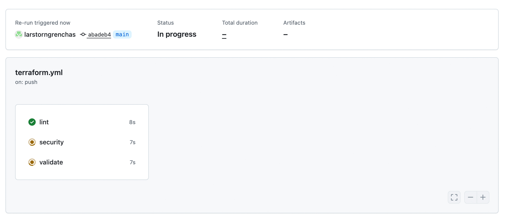
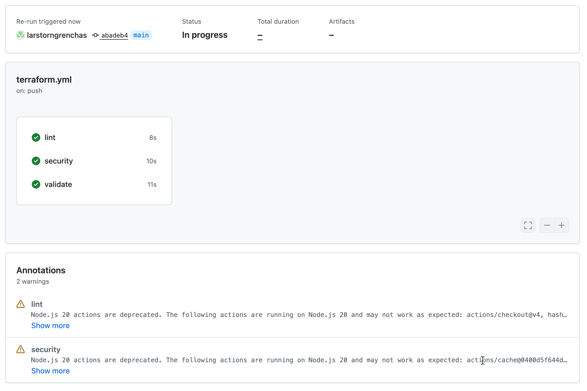
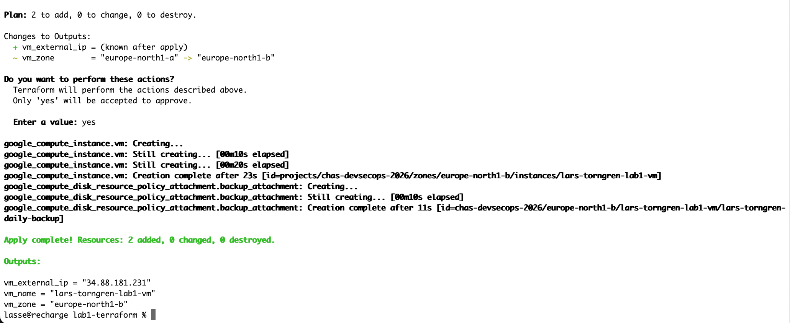
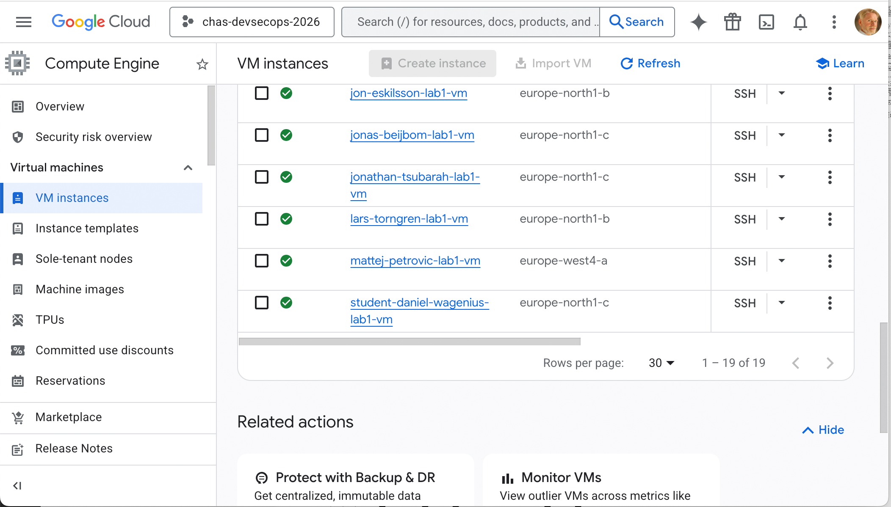
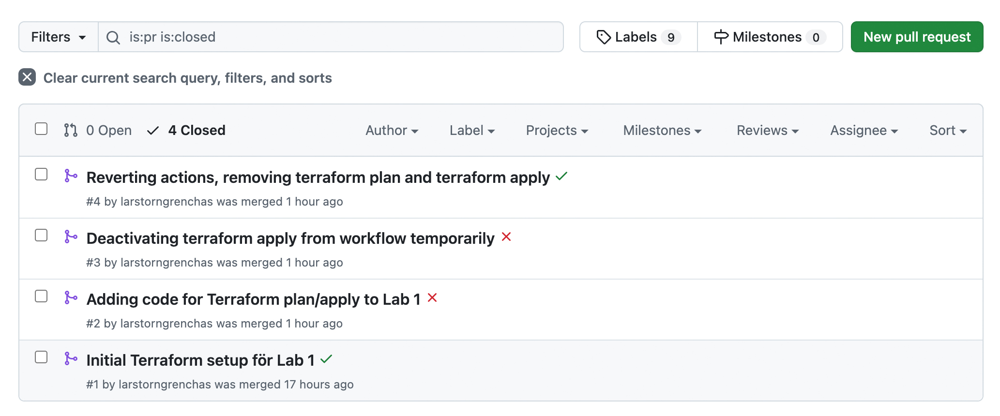

# lab1-terraform

Betygsgrundande Sprint Lab för kursen IT- och cybersäkerhetstekniker hos Chas Academy.

# Vad projektet gör

Detta projekt skapar med hjälp av Terraform-kod, en Virtual Machine på Google Cloud Platform med operativsystemet Ubuntu 22:04 LTS. Koden innehåller också tre Github Actions: Först ”lint” som kontrollerar koden, så att den inte innehåller några uppenbara felaktigheter eller buggar. Därefter körs en säkerhets-scanning av koden med Trivy. Slutligen körs en terraform init och terraform validate för att hämta providers och moduler och validera terraform-koden (men med backend=false vilket innebär att koden inte försöker kontakta fjärr-backend). Koden kör också ett start-script som installerar UFW och fail2ban, och sätter igång UFW automatiskt, samt skapar loggfilen /var/log/startup-complete.log. Därefter skapar Terraform-koden en backup-vm, med inställningar för automatisk backup klockan 03:00 varje dag, där backupen sparas i 7 dagar.

# Vad gör kommandona terraform init, terraform plan och terraform apply

Terraform init förbereder inför terraform plan och terraform apply. Det sker en kontroll av providers, initiering av backend och konfiguration av state-filen. Eventuella externa moduler laddas ner och lock-filen skapas. När man sedan kör terraform plan jämförs min lokala kod med den infrastruktur som (eventuellt) redan finns. Sen får man en lista över vad som kommer att skapas, ändras eller tas bort. När man sedan kör terraform apply genomförs det som man fick se via terraform plan. Man får samma information en gång till, och får sedan bekräfta detta med ett ”yes”. När apply-kommandot har genomförts uppdateras också state-filen.

# Säkerhetsöverväganden

Skälet till att köra start-scriptet är att en standard-installation av Ubuntu inte är konfigurerad att köra igång en brandvägg automatiskt. Start-scriptet både installerar UFW, om det inte är installerat, samt konfigurerar det så att det stoppar all inkommande trafik förutom ssh och tillåter all utgående trafik. Med tillägget fail2ban installeras en brandväggsregel som automatiskt blockerar ip-adresser efter ett visst antal misslyckade inloggningar. Dessa åtgärder skapar ett slags intialt grundskydd, som sedan behöver byggas på genom image hardening av den aktuella container-imagen, samt att genom terraform implementera ”Role-based Access Control” (RBAC).

# Skärmdumpar

