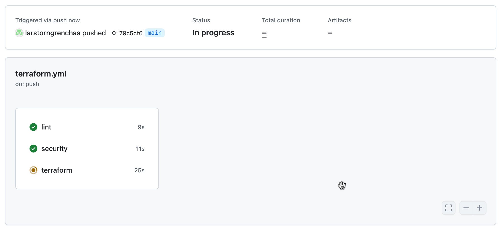
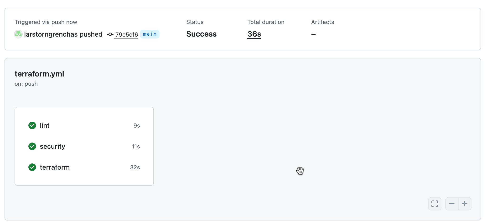
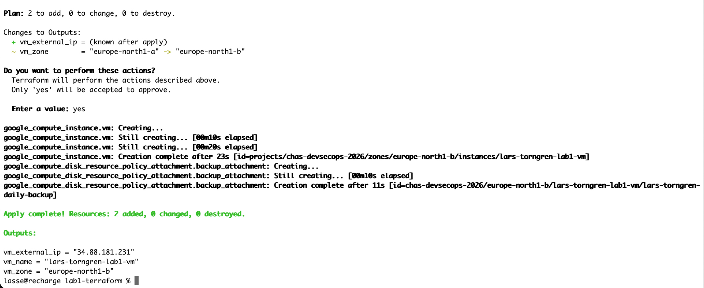
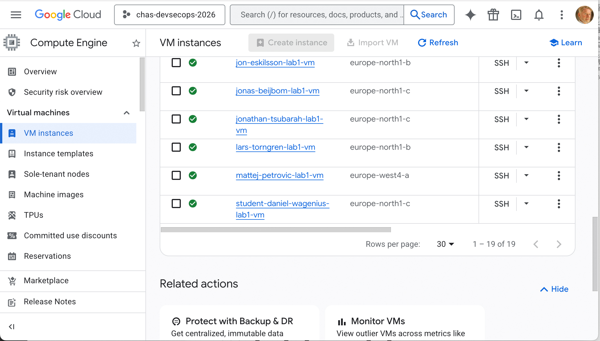
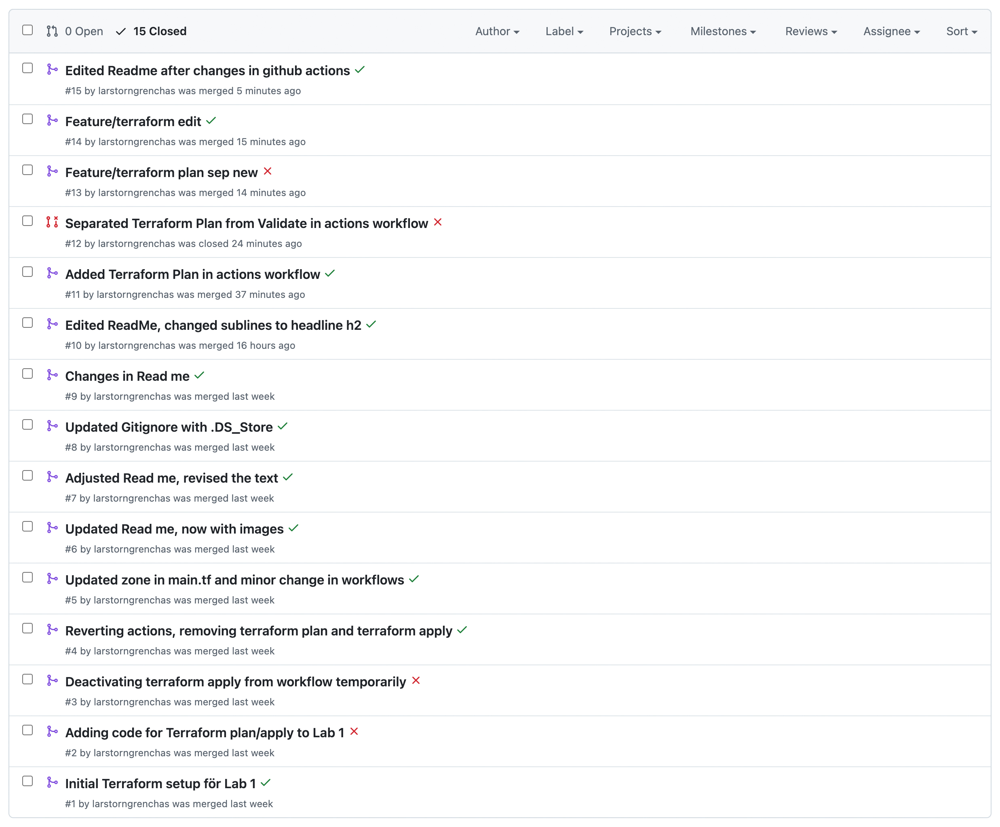

# lab1-terraform

Betygsgrundande Sprint Lab för kursen IT- och cybersäkerhetstekniker hos Chas Academy.

## Vad projektet gör
Detta projekt skapar med hjälp av Terraform-kod, en Virtual Machine på Google Cloud Platform med operativsystemet Ubuntu 22:04 LTS. Koden innehåller också tre Github Actions: Först ”lint” som kontrollerar koden, så att den inte innehåller några uppenbara felaktigheter eller buggar. Därefter körs en säkerhets-scanning av koden med Trivy. Slutligen körs terraform init, terraform validate för att hämta providers och moduler och validera terraform-koden samt terraform plan. Koden kör också ett start-script som installerar UFW och fail2ban, och sätter igång UFW automatiskt, samt skapar loggfilen /var/log/startup-complete.log. Därefter skapar Terraform-koden en backup-vm, med inställningar för automatisk backup klockan 03:00 varje dag, där backupen sparas i 7 dagar.

## Vad gör kommandona terraform init, terraform plan och terraform apply
Terraform init förbereder inför terraform plan och terraform apply. Det sker en kontroll av providers, initiering av backend och konfiguration av state-filen. Eventuella externa moduler laddas ner och lock-filen skapas. När man sedan kör terraform plan jämförs min lokala kod med den infrastruktur som (eventuellt) redan finns. Sen får man en lista över vad som kommer att skapas, ändras eller tas bort. När man sedan kör terraform apply genomförs det som man fick se via terraform plan. Man får samma information en gång till, och får sedan bekräfta detta med ett ”yes”. När apply-kommandot har genomförts uppdateras också state-filen.

## Säkerhetsöverväganden
Skälet till att köra start-scriptet är att en standard-installation av Ubuntu inte är konfigurerad att köra igång en brandvägg automatiskt. Start-scriptet både installerar UFW, om det inte är installerat, samt konfigurerar det så att det stoppar all inkommande trafik förutom ssh och tillåter all utgående trafik. Med tillägget fail2ban installeras en brandväggsregel som automatiskt blockerar ip-adresser efter ett visst antal misslyckade inloggningar. Dessa åtgärder skapar ett slags intialt grundskydd, som sedan behöver byggas på genom image hardening av den aktuella container-imagen, samt att genom terraform implementera ”Role-based Access Control” (RBAC).

## DR-dokumentation (RPO/RTO)
RPO (Recovery Point Objective): max 24h. Med vår backup-instans får vi dagliga snapshots. 
RTO (Recovery Time Objective): Max 15 minuter. Med Terraform skapas allt från scratch.
Om vår VM går ner kör vi terraform apply. Om vi behöver data från igår, återställer vi senaste snapshot via GCP Console eller gcloud compute disks create --source-snapshot.

## Hardening
Jag har jobbat en hel del med Lynis och ett startup-script som gör justeringar av standard-installationen av Ubuntu, samt laddar ner kompletterande verktyg som rekommenderas. Men allteftersom jag har lagt till saker för att få bättre hardening index, desto längre tid tar det att köra start-scriptet, och till slut blev exeveringstiden mer än 15 minuter. Med alla program som ska installeras, som också kräver vissa andra program i sin tur blir det väldigt lång tid. Och eftersom startup-scriptet måste finns på plats på den VM som körs, betyder det att vid varje förändring måste man skapa en helt ny VM. Det blir inte hållbart. Jag tittade därför på en variant att köra Packer istället, som kan skapa en färdig image som redan är ”hardened”. Tyvärr hade jag inte behörigheter för att skapa en image med Packer, så det fick jag lägga ner. I en professionell miljö skulle jag tro att det är Packer som gäller, eller också användning av de olika kommersiella härdade images som finns att tillgå (mot en kostnad givetvis).

## Skärmdumpar

